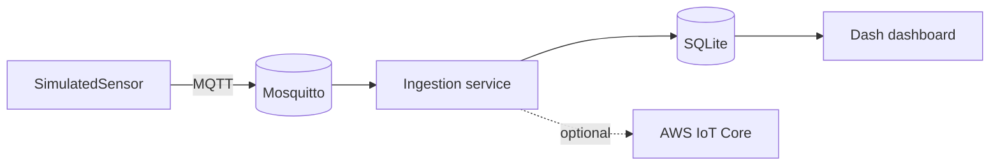

# Environmental Monitoring

[](https://github.com/maraMoreir/environmental-monitoring/actions/workflows/ci.yml)
[](pyproject.toml)
[](LICENSE)

A hexagonal-architecture IoT pipeline: sensors publish over **MQTT**, an
ingestion service validates and persists readings to **SQLite**, an
optional adapter forwards them to **AWS IoT Core**, and a **Dash**
dashboard renders whatever was actually ingested — no synthetic data in the
presentation layer. Runs end-to-end with a single `docker compose up`, at
zero cost and with no AWS account required.



See [docs/ARCHITECTURE.md](docs/ARCHITECTURE.md) for the full data-flow
diagram, layer breakdown, and the [ADRs](docs/adr/) behind each design
decision.

## Quickstart: Docker Compose (recommended)

Brings up a real Mosquitto broker, a simulated sensor publishing to it, an
ingestion service persisting to SQLite, and the dashboard — four
independent processes/containers, wired the same way a real deployment
would be.

```bash
docker compose -f docker/docker-compose.yml up --build
```

Open **http://localhost:8050** — the chart populates within a few seconds
as the simulator publishes and the ingestion service consumes.

## Quickstart: local, no Docker

Requires a running MQTT broker (e.g. `mosquitto` installed locally, or the
one from `docker compose -f docker/docker-compose.yml up mosquitto`).

```bash
python -m venv env
source env/bin/activate  # Windows: .\env\Scripts\activate
pip install -e .

# terminal 1 — publishes synthetic readings
python monitoring.py --mode simulate

# terminal 2 — subscribes, validates, persists to data/readings.db
python monitoring.py --mode ingest

# terminal 3 — reads data/readings.db, serves http://localhost:8050
python -m environmental_monitoring.dashboard
```

Copy [`.env.example`](.env.example) to `.env` to override any setting
(broker host/port, database path, dashboard port, ...). Nothing in it needs
to be a real secret — AWS credentials, if you enable AWS IoT forwarding, are
read from the standard AWS credential chain, never from this repo.

## Project structure

```
src/environmental_monitoring/
├── domain/           # SensorReading, AirQualityLevel — no I/O
├── application/       # ports.py (interfaces) + services.py (IngestionService)
├── infrastructure/    # mqtt_broker.py, aws_iot.py, repository.py, simulator.py
├── dashboard/         # Dash app factory, reads from a ReadingRepository
├── config.py          # env-var settings (pydantic-settings)
└── cli.py             # `envmon --mode simulate|ingest` — composition root
docker/                 # Dockerfile + docker-compose.yml (mosquitto/simulator/ingestion/dashboard)
docs/                   # ARCHITECTURE.md + ADRs
tests/                  # mirrors src/, one test module per adapter/service
```

## Testing

```bash
pip install -e ".[dev]"
ruff check .        # lint
ruff format --check . 
mypy src             # types
pytest                # 47 tests, unit + adapter, no live broker/DB/AWS required
```

Unit tests for `domain`/`application` use in-memory fakes; adapter tests
mock paho-mqtt/boto3 or use a `tmp_path` SQLite file. CI
(`.github/workflows/ci.yml`) runs all of the above on Python 3.11, 3.12, and
3.13, plus a Docker build sanity check.

## Configuration

All settings are environment variables with an `ENVMON_` prefix (see
[`config.py`](src/environmental_monitoring/config.py) /
[`.env.example`](.env.example)). Highlights:

| Variable | Default | Purpose |
|---|---|---|
| `ENVMON_MQTT_BROKER_HOST` | `localhost` | MQTT broker to connect to |
| `ENVMON_DATABASE_PATH` | `data/readings.db` | SQLite file shared by ingestion and the dashboard |
| `ENVMON_AWS_IOT_ENABLED` | `false` | Forward readings to AWS IoT Core (needs AWS credentials in the environment) |
| `ENVMON_DASHBOARD_PORT` | `8050` | Dashboard HTTP port |

## Limitations

- **The sensor data is synthetic.** `SimulatedSensor` generates a bounded
  random walk, not real hardware readings — see
  [docs/ARCHITECTURE.md](docs/ARCHITECTURE.md#whats-synthetic). Swapping in
  a real sensor means implementing one `ReadingSource`; nothing else
  changes.
- **SQLite is a single-writer store**, appropriate for this demo's one
  ingestion process. A production deployment would swap in a managed
  database behind the same `ReadingRepository` port (see
  [ADR 0002](docs/adr/0002-sqlite-demo-persistence.md)).
- **The Mosquitto config allows anonymous connections**, intentionally, for
  a zero-setup local demo — not meant for anything internet-facing.

## License

[MIT](LICENSE)
