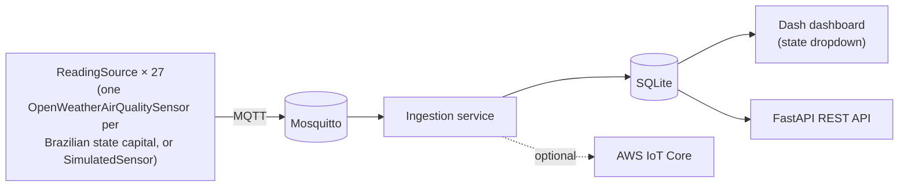

# Environmental Monitoring

[](https://github.com/maraMoreir/environmental-monitoring/actions/workflows/ci.yml)
[](pyproject.toml)
[](LICENSE)

A hexagonal-architecture IoT pipeline: sensors publish over **MQTT**, an
ingestion service validates and persists readings to **SQLite**, an
optional adapter forwards them to **AWS IoT Core**, and both a **Dash**
dashboard (Portuguese UI, per-state dropdown) and a **FastAPI** REST API
render whatever was actually ingested - no synthetic data in either
presentation layer. By default the pipeline publishes **real,
currently-measured PM2.5/PM10 for all 27 Brazilian state capitals at once**
via the OpenWeatherMap Air Pollution API (free key required); a synthetic
`SimulatedSensor` is available as a zero-signup fallback. Runs end-to-end
with a single `docker compose up`, at zero cost and with no AWS account
required.



See [docs/ARCHITECTURE.md](docs/ARCHITECTURE.md) for the full data-flow
diagram, layer breakdown, and the [ADRs](docs/adr/) behind each design
decision.

## Quickstart: Docker Compose (recommended)

Brings up a real Mosquitto broker, a sensor source publishing real
OpenWeatherMap air-quality data for all 27 Brazilian state capitals to it,
an ingestion service persisting to SQLite, the dashboard, and the REST API
- five independent processes/containers, wired the same way a real
deployment would be.

Requires a free API key (no card): sign up at
[openweathermap.org/api/air-pollution](https://openweathermap.org/api/air-pollution),
then:

```bash
cp docker/.env.example docker/.env
# edit docker/.env: set ENVMON_OPENWEATHER_API_KEY
docker compose -f docker/docker-compose.yml up --build
```

Open **http://localhost:8050** for the dashboard - pick a state from the
dropdown. The first round of all 27 capitals takes about a minute to
publish (a short delay between each API call to stay under the free-tier
rate limit), then repeats every 10 minutes by default. The REST API is at
**http://localhost:8000** (`/health`, `/sensors`, `/readings/latest`,
interactive docs at `/docs`).

Don't want to sign up for anything? Edit `docker/docker-compose.yml`'s
`sensor-source` service - change `command` to
`["monitoring.py", "--mode", "simulate"]` and drop the `ENVMON_OPENWEATHER_API_KEY`
line - to run the zero-signup synthetic simulator instead (single sensor,
`sensor-001`).

## Quickstart: local, no Docker

Requires a running MQTT broker (e.g. `mosquitto` installed locally, or the
one from `docker compose -f docker/docker-compose.yml up mosquitto`).

```bash
python -m venv env
source env/bin/activate  # Windows: .\env\Scripts\activate
pip install -e .

# terminal 1 - publishes synthetic readings
python monitoring.py --mode simulate

# terminal 2 - subscribes, validates, persists to data/readings.db
python monitoring.py --mode ingest

# terminal 3 - reads data/readings.db, serves http://localhost:8050
python -m environmental_monitoring.dashboard

# terminal 4 (optional) - REST API at http://localhost:8000/docs
python -m environmental_monitoring.api
```

Copy [`.env.example`](.env.example) to `.env` to override any setting
(broker host/port, database path, dashboard port, ...). Nothing in it needs
to be a real secret - AWS credentials, if you enable AWS IoT forwarding, are
read from the standard AWS credential chain, never from this repo.

### Using real data instead of the simulator

Three `--mode` values publish over MQTT (swap in place of `simulate` above):

| Mode | Publishes | Needs |
|---|---|---|
| `simulate` | Synthetic readings for one sensor (`sensor-001`) | nothing |
| `openweather` | Real PM2.5/PM10 for one configured location | `ENVMON_OPENWEATHER_API_KEY`, `ENVMON_OPENWEATHER_LATITUDE`/`LONGITUDE` |
| `openweather-br` | Real PM2.5/PM10 for all 27 Brazilian state capitals (the Docker Compose default) | `ENVMON_OPENWEATHER_API_KEY` |

```bash
export ENVMON_OPENWEATHER_API_KEY=your-free-api-key
python monitoring.py --mode openweather-br
```

Everything downstream (ingestion, SQLite, the dashboard, the API) is
unchanged regardless of mode - `OpenWeatherAirQualitySensor` implements the
same `ReadingSource` port as `SimulatedSensor`, one instance per location
(see
[`infrastructure/openweather_sensor.py`](src/environmental_monitoring/infrastructure/openweather_sensor.py)
and
[`domain/locations.py`](src/environmental_monitoring/domain/locations.py)).

## REST API

A second, independent read path over the same persisted data - for another
service or client, not a second ingestion pipeline. Interactive docs (Swagger
UI) are auto-generated at `/docs`.

```bash
curl http://localhost:8000/health
curl http://localhost:8000/sensors                                    # list sensor IDs, e.g. ["br-rj","br-sp",...]
curl http://localhost:8000/readings/latest?sensor_id=br-sp&limit=10   # filter to one sensor
```

```json
[
  {
    "sensor_id": "br-sp",
    "timestamp": "2026-07-23T18:25:38.175647+00:00",
    "pm2_5": 21.5,
    "pm10": 31.0,
    "temperature_celsius": 23.7,
    "humidity_percent": 54.0,
    "air_quality_level": "moderate"
  }
]
```

## Project structure

```
src/environmental_monitoring/
├── domain/           # SensorReading, AirQualityLevel - no I/O
├── application/       # ports.py (interfaces) + services.py (IngestionService)
├── infrastructure/    # mqtt_broker.py, aws_iot.py, repository.py, simulator.py, openweather_sensor.py
├── dashboard/         # Dash app factory, reads from a ReadingRepository
├── api/                # FastAPI app factory, reads from the same ReadingRepository
├── config.py          # env-var settings (pydantic-settings)
└── cli.py             # `envmon --mode simulate|openweather|ingest` - composition root
docker/                 # Dockerfile + docker-compose.yml (mosquitto/sensor-source/ingestion/dashboard/api)
docs/                   # ARCHITECTURE.md + ADRs
tests/                  # mirrors src/, one test module per adapter/service
```

## Testing

```bash
pip install -e ".[dev]"
ruff check .        # lint
ruff format --check . 
mypy src             # types
pytest                # unit + adapter tests, no live broker/DB/AWS/OpenWeatherMap required
```

Unit tests for `domain`/`application` use in-memory fakes; adapter tests
mock paho-mqtt/boto3 or use a `tmp_path` SQLite file. CI
(`.github/workflows/ci.yml`) runs all of the above on Python 3.11, 3.12, and
3.13, plus a Docker build sanity check.

## Configuration

All settings are environment variables with an `ENVMON_` prefix (see
[`config.py`](src/environmental_monitoring/config.py) /
[`.env.example`](.env.example)). Highlights:

| Variable | Default | Purpose |
|---|---|---|
| `ENVMON_MQTT_BROKER_HOST` | `localhost` | MQTT broker to connect to |
| `ENVMON_DATABASE_PATH` | `data/readings.db` | SQLite file shared by ingestion and the dashboard |
| `ENVMON_AWS_IOT_ENABLED` | `false` | Forward readings to AWS IoT Core (needs AWS credentials in the environment) |
| `ENVMON_DASHBOARD_PORT` | `8050` | Dashboard HTTP port |
| `ENVMON_API_PORT` | `8000` | REST API HTTP port |
| `ENVMON_OPENWEATHER_API_KEY` | *(empty)* | Required for `--mode openweather` (the Docker Compose default) - real air-quality data |

## Limitations

- **Real, but not from real hardware.** The default `--mode openweather`
  publishes actual currently-measured PM2.5/PM10 from a public API - real
  data, but sourced from OpenWeatherMap's network, not a physical sensor
  this project owns. `SimulatedSensor` (`--mode simulate`) is also
  available as a zero-signup synthetic fallback - see
  [docs/ARCHITECTURE.md](docs/ARCHITECTURE.md#whats-synthetic). A real
  hardware sensor would be one more `ReadingSource` implementation; nothing
  else in the pipeline changes.
- **SQLite is a single-writer store**, appropriate for this demo's one
  ingestion process. A production deployment would swap in a managed
  database behind the same `ReadingRepository` port (see
  [ADR 0002](docs/adr/0002-sqlite-demo-persistence.md)).
- **The Mosquitto config allows anonymous connections**, intentionally, for
  a zero-setup local demo - not meant for anything internet-facing.

## License

[MIT](LICENSE)
