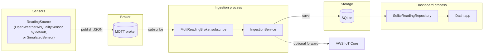

# Architecture

Environmental Monitoring is a small hexagonal-architecture (ports &
adapters) system. The `domain` and `application` layers contain all the
business logic and have zero dependencies on MQTT, SQLite, Dash, or AWS;
everything that talks to the outside world lives in `infrastructure/` behind
a `Protocol` interface defined in `application/ports.py`.

## Data flow

Two independent processes share the SQLite file: `envmon --mode ingest`
(writer) and the dashboard (reader). In Docker Compose they're two
containers sharing a volume; run locally, they're two terminals.

## Layers

| Layer | Package | Depends on | Contains |
|---|---|---|---|
| Domain | `domain/` | nothing | `SensorReading`, `AirQualityLevel`, `locations.py` (Brazil's 27 state capitals), validation |
| Application | `application/` | `domain/` | `ports.py` (`Protocol`s - `ReadingRepository.latest` takes an optional `sensor_id` filter, plus `distinct_sensor_ids()`), `services.py` (`IngestionService`) |
| Infrastructure | `infrastructure/` | `application/`, `domain/` | `mqtt_broker.py`, `aws_iot.py`, `repository.py`, `simulator.py`, `openweather_sensor.py` |
| Dashboard | `dashboard/` | `application/`, `domain/locations.py` (labels only) | Dash app factory, per-sensor dropdown |
| API | `api/` | `application/` (port only) | FastAPI app factory -`/health`, `/sensors`, `/readings/latest` |
| Composition root | `cli.py`, `dashboard/__main__.py`, `api/__main__.py` | everything | wires concrete adapters into services |

The dependency direction is always inward: `infrastructure`, `dashboard`, and
`api` import `application`'s ports, never the other way around. This is what
lets `IngestionService` be unit-tested with in-memory fakes instead of a live
broker or database (`tests/unit/test_services.py`).

Multiple sensors can publish into the same pipeline (e.g. all 27 Brazilian
state capitals under `--mode openweather-br`, each with its own `sensor_id`);
the dashboard and API both let a caller filter to one via `sensor_id`, so a
single deployment can serve per-state air quality without per-state
infrastructure.

## Why these choices

Short version - see the ADRs for the full reasoning:

- [0001 - hexagonal architecture](adr/0001-hexagonal-architecture.md)
- [0002 - SQLite for demo persistence](adr/0002-sqlite-demo-persistence.md)
- [0003 - paho-mqtt v2 callback API & AWS IoT as optional](adr/0003-mqtt-v2-callback-api.md)

## What's real, what's synthetic, and what's neither

There is no physical hardware sensor behind this project. By default
(`--mode openweather-br`, what the Docker Compose demo runs) the pipeline
publishes **real, currently-measured** PM2.5/PM10 for all 27 Brazilian state
capitals at once - one process, one MQTT connection, 27
`OpenWeatherAirQualitySensor` instances (see
[`domain/locations.py`](../src/environmental_monitoring/domain/locations.py)
for the coordinates), each `sensor_id`-tagged `br-<state code>`, polled once
per round with a short delay between calls to stay well under the API's rate
limit. `--mode openweather` does the same for a single configured
latitude/longitude if you don't need all 27. Either way it's real data,
sourced from a third-party API rather than hardware this project owns.

`SimulatedSensor` (`--mode simulate`) is the zero-signup alternative: a
bounded random walk of PM2.5/PM10/temperature/humidity, clearly labeled as
synthetic, not disguised as real sensor data.

All three implement the exact same `ReadingSource` port - proof that
swapping (or multiplying) data sources is cheap. Nothing in `application/`,
`dashboard/`, or `api/` changes based on which one is running; see
[`infrastructure/openweather_sensor.py`](../src/environmental_monitoring/infrastructure/openweather_sensor.py)
and
[`infrastructure/simulator.py`](../src/environmental_monitoring/infrastructure/simulator.py).
A real hardware sensor would be implemented the same way.
