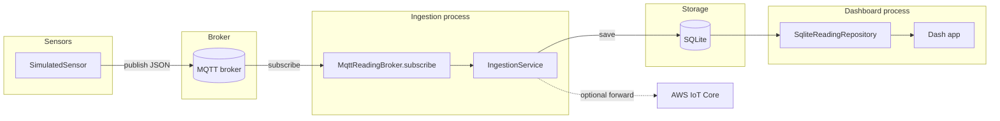

# Architecture

Environmental Monitoring is a small hexagonal-architecture (ports &
adapters) system. The `domain` and `application` layers contain all the
business logic and have zero dependencies on MQTT, SQLite, Dash, or AWS;
everything that talks to the outside world lives in `infrastructure/` behind
a `Protocol` interface defined in `application/ports.py`.

## Data flow

Two independent processes share the SQLite file: `envmon --mode ingest`
(writer) and the dashboard (reader). In Docker Compose they're two
containers sharing a volume; run locally, they're two terminals.

## Layers

| Layer | Package | Depends on | Contains |
|---|---|---|---|
| Domain | `domain/` | nothing | `SensorReading`, `AirQualityLevel`, validation |
| Application | `application/` | `domain/` | `ports.py` (`Protocol`s), `services.py` (`IngestionService`) |
| Infrastructure | `infrastructure/` | `application/`, `domain/` | `mqtt_broker.py`, `aws_iot.py`, `repository.py`, `simulator.py`, `openweather_sensor.py` |
| Dashboard | `dashboard/` | `application/` (port only) | Dash app factory |
| Composition root | `cli.py`, `dashboard/__main__.py` | everything | wires concrete adapters into services |

The dependency direction is always inward: `infrastructure` and `dashboard`
import `application`'s ports, never the other way around. This is what lets
`IngestionService` be unit-tested with in-memory fakes instead of a live
broker or database (`tests/unit/test_services.py`).

## Why these choices

Short version — see the ADRs for the full reasoning:

- [0001 — hexagonal architecture](adr/0001-hexagonal-architecture.md)
- [0002 — SQLite for demo persistence](adr/0002-sqlite-demo-persistence.md)
- [0003 — paho-mqtt v2 callback API & AWS IoT as optional](adr/0003-mqtt-v2-callback-api.md)

## What's synthetic (and what isn't)

There is no real hardware behind this project. `SimulatedSensor` generates a
bounded random walk of PM2.5/PM10/temperature/humidity — used by the default
Docker Compose demo — clearly labeled as synthetic, not disguised as real
sensor data.

`OpenWeatherAirQualitySensor` (`--mode openweather`) is the concrete proof
that swapping data sources is cheap: it implements the exact same
`ReadingSource` port and fetches real, currently-measured PM2.5/PM10 from the
OpenWeatherMap Air Pollution API for a given latitude/longitude. Nothing in
`application/` or `dashboard/` changed to add it — see
[`infrastructure/openweather_sensor.py`](../src/environmental_monitoring/infrastructure/openweather_sensor.py).
A real hardware sensor would be implemented the same way.
